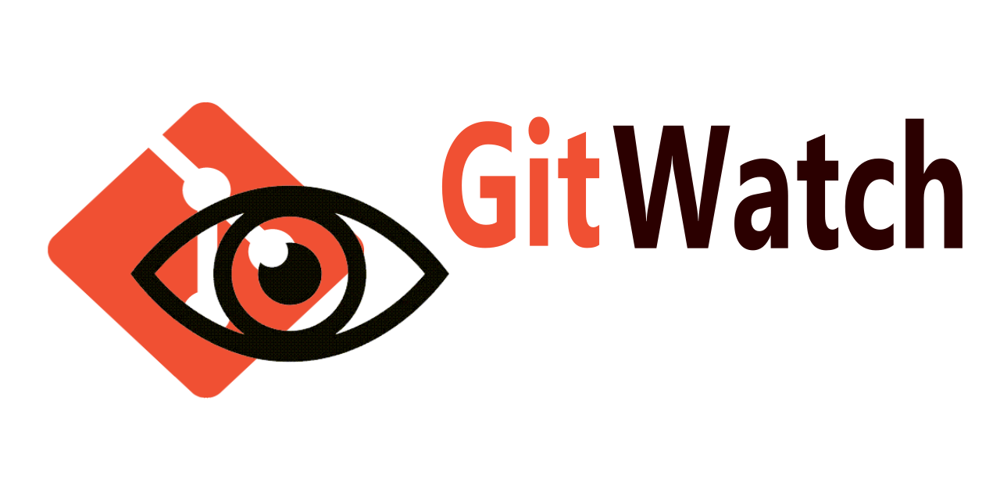

# gitwatch

> Short blurb about what your product does.

[![PyPI][pypi-image]][pypi-url]
[![Downloads][downloads-image]][downloads-url]
[![Status][status-image]][pypi-url]
[![Python Version][python-version-image]][pypi-url]
[![tests][tests-image]][tests-url]
[![Codecov][codecov-image]][codecov-url]
[![CodeQl][codeql-image]][codeql-url]
[![Docker][docker-image]][docker-url]
[![pre-commit][pre-commit-image]][pre-commit-url]
[![pre-commit.ci status][pre-commit.ci-image]][pre-commit.ci-url]
[![readthedocs][readthedocs-image]][readthedocs-url]
[![CodeFactor][codefactor-image]][codefactor-url]
[![Codeclimate][codeclimate-image]][codeclimate-url]
[![Imports: isort][isort-image]][isort-url]
[![Code style: black][black-image]][black-url]
[![Checked with mypy][mypy-image]][mypy-url]
[![security: bandit][bandit-image]][bandit-url]
[![Commitizen friendly][commitizen-image]][commitizen-url]
[![Conventional Commits][conventional-commits-image]][conventional-commits-url]
[![DeepSource][deepsource-image]][deepsource-url]
[![license][license-image]][license-url]
[![Pydough][pydough-image]][pydough-url]
[![OpenSSFScorecard][openssf-image]][openssf-url]

One to two paragraph statement about your product and what it does.



## Installation

---

OS X & Linux:

```sh
pip3 install gitwatch
```

Windows:

```sh
pip install gitwatch
```

## Usage example

---

A few motivating and useful examples of how your product can be used. Spice this up with code blocks and potentially more screenshots.

_For more examples and usage, please refer to the [Wiki][wiki]._

## Development setup

---

Describe how to install all development dependencies and how to run an automated test-suite of some kind. Potentially do this for multiple platforms.

```sh
pip install --editable gitwatch
```

## Documentation

---

[**Read the Docs**](https://gitwatch.readthedocs.io/en/latest/)

-   [**Example Usage**](https://gitwatch.readthedocs.io/en/latest/example.html)
-   [**Credits**](https://gitwatch.readthedocs.io/en/latest/example.html)
-   [**Changelog**](https://gitwatch.readthedocs.io/en/latest/changelog.html)
-   [**API Reference**](https://gitwatch.readthedocs.io/en/latest/autoapi/index.html)

[**Wiki**](https://github.com/Stephen-RA-King/gitwatch/wiki)

## Meta

---

[](https://www.linkedin.com/in/sr-king)
[](https://github.com/Stephen-RA-King)
[](https://pypi.org/project/gitwatch)
[](https://hub.docker.com/r/sraking/gitwatch)
[](https://stephen-ra-king.github.io/justpython/)
[](mailto:sking.github@gmail.com)

Author: Stephen R A King ([sking.github@gmail.com](mailto:sking.github@gmail.com))

Distributed under the MIT license. See [![][license-image]][license-url] for more information.

Created with Cookiecutter template: [![pydough][pydough-image]][pydough-url] version 1.3.3

Digital object identifier: [](https://zenodo.org/badge/latestdoi/xxxxxxxxx)

<!-- Markdown link & img dfn's -->

[bandit-image]: https://img.shields.io/badge/security-bandit-yellow.svg
[bandit-url]: https://github.com/PyCQA/bandit
[black-image]: https://img.shields.io/badge/code%20style-black-000000.svg
[black-url]: https://github.com/psf/black
[codeclimate-image]: https://api.codeclimate.com/v1/badges/7fc352185512a1dab75d/maintainability
[codeclimate-url]: https://codeclimate.com/github/Stephen-RA-King/gitwatch/maintainability
[codecov-image]: https://codecov.io/gh/Stephen-RA-King/gitwatch/branch/main/graph/badge.svg
[codecov-url]: https://app.codecov.io/gh/Stephen-RA-King/gitwatch
[codefactor-image]: https://www.codefactor.io/repository/github/Stephen-RA-King/gitwatch/badge
[codefactor-url]: https://www.codefactor.io/repository/github/Stephen-RA-King/gitwatch
[codeql-image]: https://github.com/Stephen-RA-King/gitwatch/actions/workflows/github-code-scanning/codeql/badge.svg
[codeql-url]: https://github.com/Stephen-RA-King/gitwatch/actions/workflows/github-code-scanning/codeql
[commitizen-image]: https://img.shields.io/badge/commitizen-friendly-brightgreen.svg
[commitizen-url]: http://commitizen.github.io/cz-cli/
[conventional-commits-image]: https://img.shields.io/badge/Conventional%20Commits-1.0.0-yellow.svg?style=flat-square
[conventional-commits-url]: https://conventionalcommits.org
[deepsource-image]: https://static.deepsource.io/deepsource-badge-light-mini.svg
[deepsource-url]: https://deepsource.io/gh/Stephen-RA-King/gitwatch/?ref=repository-badge
[docker-image]: https://github.com/Stephen-RA-King/gitwatch/actions/workflows/docker-image.yml/badge.svg
[docker-url]: https://github.com/Stephen-RA-King/gitwatch/actions/workflows/docker-image.yml
[downloads-image]: https://static.pepy.tech/personalized-badge/gitwatch?period=total&units=international_system&left_color=black&right_color=orange&left_text=Downloads
[downloads-url]: https://pepy.tech/project/gitwatch
[format-image]: https://img.shields.io/pypi/format/gitwatch
[isort-image]: https://img.shields.io/badge/%20imports-isort-%231674b1?style=flat&labelColor=ef8336
[isort-url]: https://github.com/pycqa/isort/
[lgtm-alerts-image]: https://img.shields.io/lgtm/alerts/g/Stephen-RA-King/gitwatch.svg?logo=lgtm&logoWidth=18
[lgtm-alerts-url]: https://lgtm.com/projects/g/Stephen-RA-King/gitwatch/alerts/
[lgtm-quality-image]: https://img.shields.io/lgtm/grade/python/g/Stephen-RA-King/gitwatch.svg?logo=lgtm&logoWidth=18
[lgtm-quality-url]: https://lgtm.com/projects/g/Stephen-RA-King/gitwatch/context:python
[license-image]: https://img.shields.io/pypi/l/gitwatch
[license-url]: https://github.com/Stephen-RA-King/gitwatch/blob/main/LICENSE
[mypy-image]: http://www.mypy-lang.org/static/mypy_badge.svg
[mypy-url]: http://mypy-lang.org/
[openssf-image]: https://api.securityscorecards.dev/projects/github.com/Stephen-RA-King/gitwatch/badge
[openssf-url]: https://api.securityscorecards.dev/projects/github.com/Stephen-RA-King/gitwatch
[pre-commit-image]: https://img.shields.io/badge/pre--commit-enabled-brightgreen?logo=pre-commit&logoColor=white
[pre-commit-url]: https://github.com/pre-commit/pre-commit
[pre-commit.ci-image]: https://results.pre-commit.ci/badge/github/Stephen-RA-King/gitwatch/main.svg
[pre-commit.ci-url]: https://results.pre-commit.ci/latest/github/Stephen-RA-King/gitwatch/main
[pydough-image]: https://img.shields.io/badge/pydough-2023-orange
[pydough-url]: https://github.com/Stephen-RA-King/pydough
[pypi-url]: https://pypi.org/project/gitwatch/
[pypi-image]: https://img.shields.io/pypi/v/gitwatch.svg
[python-version-image]: https://img.shields.io/pypi/pyversions/gitwatch
[readthedocs-image]: https://readthedocs.org/projects/gitwatch/badge/?version=latest
[readthedocs-url]: https://gitwatch.readthedocs.io/en/latest/?badge=latest
[status-image]: https://img.shields.io/pypi/status/gitwatch.svg
[tests-image]: https://github.com/Stephen-RA-King/gitwatch/actions/workflows/tests.yml/badge.svg
[tests-url]: https://github.com/Stephen-RA-King/gitwatch/actions/workflows/tests.yml
[wiki]: https://github.com/Stephen-RA-King/gitwatch/wiki
